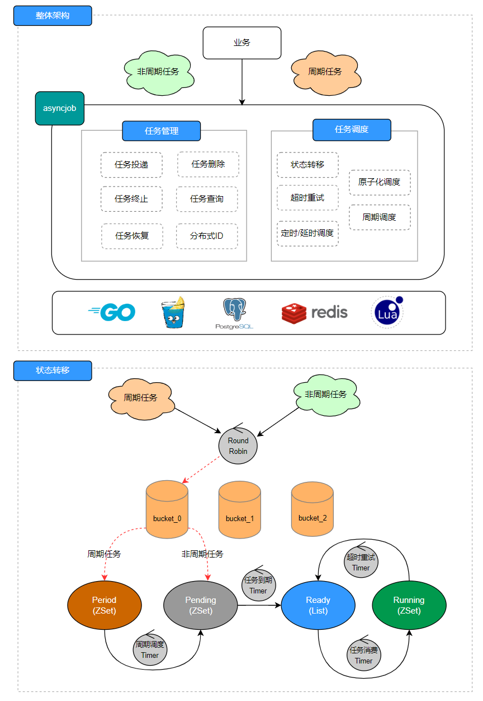
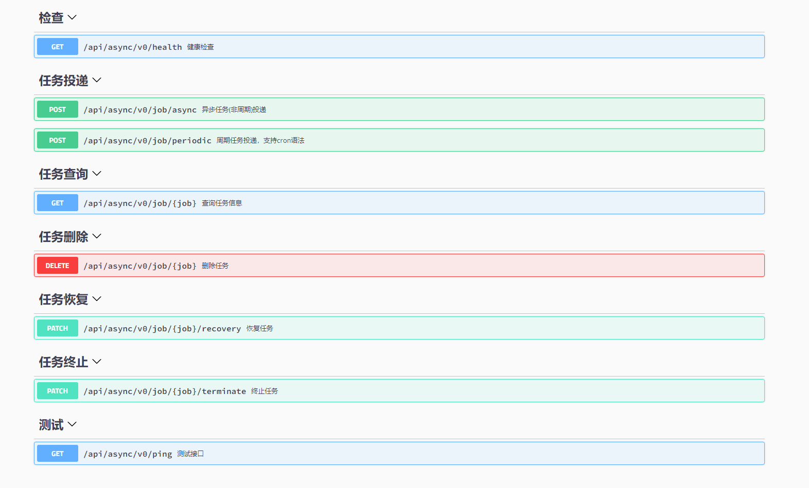

# asyncjob

基于Go+Redis+Lua实现的原子调度异步任务服务，支持周期任务，定时/延时异步任务

* 支持原子化调度，避免任务重复消费
* 支持任务的投递,查询,终止,恢复,删除
* 支持分钟级周期任务和cron语法
* 支持超时重试
* 允许存在一定的时间误差，(默认test_msg类型，10s发送1w条消息)
* 基于Leaf-segment方案实现分布式自增id生成器
* 支持Docker一键部署，水平扩展保证高可用

## 目录

| [架构](#架构) |  [API](#API文档) | [技术栈](#技术栈) | [本地](#本地调试) |[扩展](#扩展handler) | [单机](#单机部署) | [集群](#集群部署) | [问题](#问题) |
|:---------:|:-------------:|:-----------:|:-------------:|:-----------:|:-----------:|:-----------:|:-----------:|

## 架构



## API文档



## 技术栈

* Golang
* Gin
* GORM
* Redis
* PostgreSQL
* Swagger
* Docker

## 本地调试

### 基础服务

* 启动pg数据库

```shell
docker run -d --restart=always -p 5432:5432 --name=postgresql -v `pwd`/pg:/var/lib/postgresql/data -e POSTGRES_PASSWORD=123456 postgres
```

* 启动redis

```shell
docker run -d --restart=always --name myredis -p 6379:6379 redis --requirepass "123456"
```

### 配置修改

* 修改配置文件

```shell
app:
  env: prod
  port: 8888                # 服务端口
  app_name: asyncjob         # 服务名称
  app_url: http://127.0.0.1

log:
  level: info               # 日志等级
  root_dir: ./storage/logs  # 日志根目录
  filename: app.log         # 日志文件名称
  format: json              # 写入格式 可选json
  show_line: true           # 是否显示调用行
  max_backups: 3            # 旧文件的最大个数
  max_size: 500             # 日志文件最大大小（MB）
  max_age: 28               # 旧文件的最大保留天数
  compress: true            # 是否压缩
  enable_file: false        # 是否启用日志文件

database:
  - db_name: default
    driver: postgres                # 数据库驱动
    host: 127.0.0.1                 # 服务地址
    port: 5432                      # 端口号
    database: postgres              # 数据库名称
    username: postgres              # 用户名
    password: 123456                # 密码
    charset: utf8mb4                # 编码格式
    max_idle_conns: 10              # 空闲连接池中连接的最大数量
    max_open_conns: 100             # 打开数据库连接的最大数量
    log_mode: info                  # 日志级别
    enable_lg_log: false            # 是否开启自定义日志
    enable_file_log_writer: false   # 是否打印到日志文件
    log_filename: sql.log           # 日志文件名称

redis:
  host: 127.0.0.1        # 服务地址
  port: 6379             # 服务端口
  db: 0                  # 库选择
  password: 123456       # 密码
 
smtp_server:
  host: smtp.office365.com
  port: 587
  user: asyncjob@outlook.com
  password: ******
```

### 服务启动

```shell
# 设置goproxy
Linux: go env -w GOPROXY=https://goproxy.cn,direct
Windows: $env:GOPROXY = "https://goproxy.cn"

# 拉取依赖
go mod tidy
go install github.com/swaggo/swag/cmd/swag@v1.8.1


# 生成api文档
swag fmt -g cmd/main.go -d ./
swag init -g cmd/main.go
http://127.0.0.1:8888/swagger/index.html#/
```

### 服务测试
```shell
  # 修改服务地址和上传文件
  baseUrl := "http://127.0.0.1:8888"
  # 启动服务
  go run cmd/main.go
  # 测试
  go run test/asyncjob.go
```

### 本地构建镜像

```shell
# 这里使用dockerhub作为镜像仓库，请提前创建好账户密码

# 登录，username和passwd替换成有效的账户密码
echo passwd | docker login --username=username --password-stdin

# 本地构建，version替换成自定义的有效字符，比如v0.1
docker build -t asyncjob:version -f deploy/Dockerfile  .

# 镜像重命名，qinguoyi/object-storage-proxy请替换成你的username/repo
docker tag asyncjob:version qinguoyi/asyncjob:version

# 镜像上传
docker push qinguoyi/asyncjob:version
```

## 扩展handler

```golang
func init() {
    event.NewEventsHandler().RegHandler(utils.TaskMailMsg, handleMail)
}

type MailMsg struct {
    ToList  []string `json:"toList"`
    Subject string   `json:"subject"`
    Content string   `json:"content"`
}

func handleMail(i interface{}, c context.Context, t <-chan time.Time, s chan struct{}) error {
    var msgMail MailMsg
    msgByte, _ := json.Marshal(i)
    if err := json.Unmarshal(msgByte, &msgMail); err != nil {
        bootstrap.NewLogger().Logger.Info(fmt.Sprintf("unmashal job failed: %v", err))
        return fmt.Errorf("unmashal job failed: %v", err)
    }
    if len(msgMail.ToList) == 0 || msgMail.Subject == "" || msgMail.Content == "" {
        return fmt.Errorf("参数有误")
    }
    if err := base.NewMailService().Send(msgMail.ToList, msgMail.Subject, msgMail.Content); err != nil {
        return err
    }
	return nil
}
```

## 单机部署

**注意：单机部署，安装docker compose**

### 配置修改

* 修改config.yaml
    * 使用的是compose，config中的各服务的host，指向的是compose service的名字，比如db，redis等

### 启动服务

```shell
docker compose up -d
```

### 服务测试
```shell
  # 修改服务地址和上传文件
  baseUrl := "http://127.0.0.1:8888"
  # 启动服务
  go run cmd/main.go
  # 测试
  go run test/asyncjob.go
  ```

### 停止服务

```shell
docker compose down
```

## 集群部署

* docker-swarm或者k8s部署

## 问题

* 消息持久化依赖Redis
* 消息增长太快，会造成async的大key问题，建议增加pg做结果消息持久化
* bucket越多，抢占时间越长
* 任务终止/超时/退出信号，需要再handler中捕获处理，外层服务无法kill协程

## License

Distributed under the Apache 2.0 License. See LICENSE for more information.